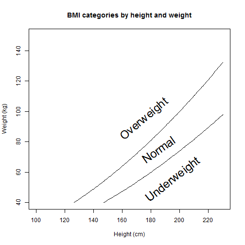

BMI calculator Presentation
========================================================
author: KrzyKu
date: Thu Mar 19 21:13:40 2015

About app
========================================================

Application calculates Body Mass Index


Values needed to input from user
- Weight [kg]
- Height [cm]


BMI 
========================================================

Calculation defualt values:
height = 170
weight = 70


```r
calcBMI <-function(height,weight) {weight/((height/100)*(height/100))}

calcBMI(170,70)
```

```
[1] 24.22145
```


BMI cm,kg
========================================================

 

BMI lbs,inches
========================================================

 
